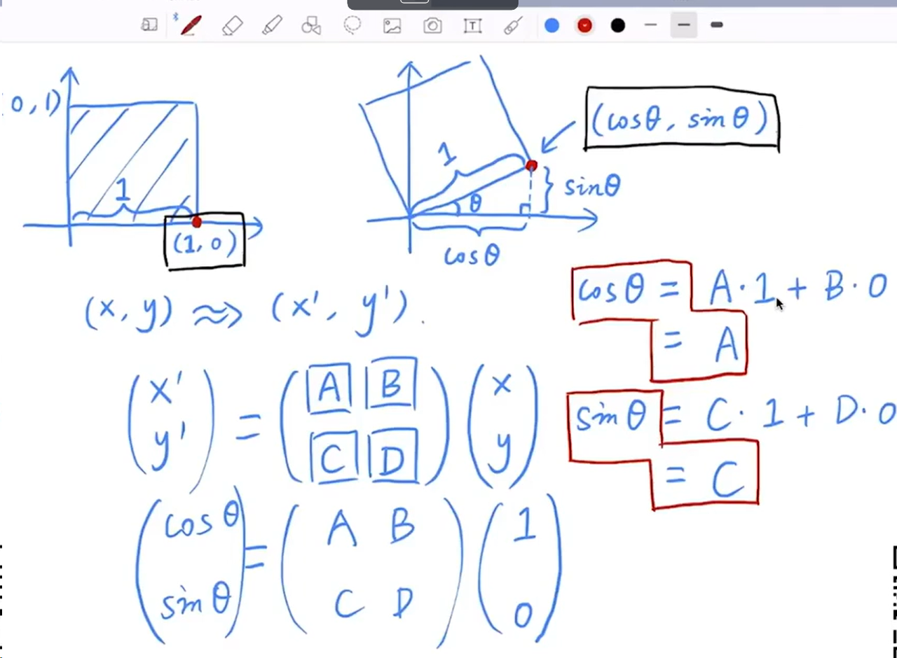

课程链接：

[现代计算机图形学入门-闫令琪](https://www.bilibili.com/video/BV1X7411F744/?p=2&spm_id_from=pageDriver&vd_source=7aad4efc9051c9adb163c586482031e8)

## 线性代数

**注：本课程的所有坐标系都认定为右手坐标系，所有二维旋转视为逆时针旋转**

叉乘的妙用：

可以用来判断一个点是是否落在三角形内部：

分别用AB、BC、CA向量与AP、BP、PC向量做叉乘，如果结果向量朝向一致，那么点P的位置就在三角形内部，反之则在三角形外部。可以依据脑补得知，无论A、B、C的顺序是顺时针还是逆时针，这个结果都不会改变。

如果是叉乘结果为0的情况，可由个人喜好决定是否算在三角形内部，可以模糊处理。

    

叉乘的矩阵表示方法（什么是dual matrix？好像不是伴随矩阵）

    

## Transformation 变换

常见的变换有线性变换、非线性变换两种。其中线性变换包括旋转、缩放、切变，非线性变换包括平移。

切变：

    

旋转的求证方式：

    

将旋转、缩放和平移组合称为仿射变换（Affine Transform）。

    

为了方便，用齐次坐标矩阵表示仿射变换，二者的效果是一样的。齐次坐标矩阵拥有比较固定的格式，最后一行是001（二维的情况）。相应的，被变换的对象向量或者点也要增加一维。

    

多种变换可以组合，数学上的计算是通过矩阵左乘的方式。一般来说，是先旋转和缩放，后平移，这是一种约定俗成，因为以原点为中心进行旋转是比较方便的。如果遇到了不以原点为中心进行旋转的情况，也可以先平移回原点，旋转后再平移回去，如图所示。

    

使用齐次坐标进行变换时，对点和向量有不同的表示方法，一般来说，为点加上的常数是1，因为点是可以平移的，而为向量加上的常数是0，向量是不可以平移的。

    

对点与向量之间的计算意义如下，他们和数学运算的结果是匹配的。

    

特别的，当两个点相加时，齐次坐标的w分量会大于1，此时规定w分量大于1的时候，该坐标等价于所有维度同时除以w分量的值。也就是说，点与点的和的几何含义是两点的中点。

'注意：w分量其实有着更重要的几何含义，即透视坐标中点距离观察者的位置。'具体可看资料：

[齐次坐标w分量的几何意义](https://www.tomdalling.com/blog/modern-opengl/explaining-homogenous-coordinates-and-projective-geometry/)

因此，w分量有着0、1以外的其他取值，并且是有意义的。当一个点的齐次坐标的w值发生变化的时候，说明这个点在透视空间中相对于观察点的距离变远了。（这个数学上的观察点是虚构的，如果要把它和放在原点的摄像机对应上，那么坐标的w分量应该从1变为z的值，说白了就是用一个数字表示近大远小）

透视除法：将所有维度除以w分量的值，使w=1。

**第二课：三维变换**

三维的情况与二维基本一致，最复杂的是旋转的情况。

三维旋转：

最普通的情况是绕x轴、y轴和z轴的旋转，他们对应的齐次坐标变换矩阵如下，注意中间沿y轴旋转的矩阵是反的，这是在三维的右手坐标系下坐标轴的顺序决定的。可以通过Z × X = Y看出，在XZ平面上，α角是与z轴正方向的逆时针夹角，而非x轴的，因此在应用时要对原本的二维矩阵进转置。

复杂旋转可以拆分为绕x、y、z轴的旋转（但是课程中没有说明旋转的顺序问题，也没有说明旋转时旋转轴是否要跟着转）绕任意轴的旋转可以通过Rodirigues公式转换为矩阵的形式。这里默认旋转轴是过原点的（不然光用一个向量是无法定义旋转轴的）。

    

注意：旋转矩阵是正交矩阵，正交矩阵的逆等于它的转置。二维空间的证明如下：

    

