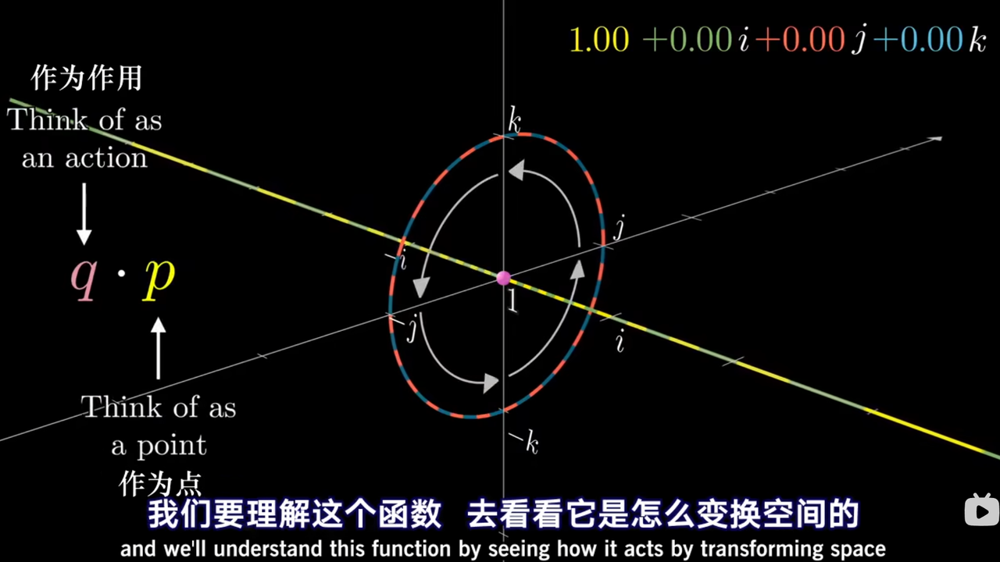

## 欧拉角：

欧拉角，一种表示旋转变换的方式，欧拉角的变换是有顺序的，比如x - y - z，且这个顺序是不会因为用户以何种顺序设置它们的值而发生变化，例如：

用户A：先绕x轴旋转变换10度，再绕y轴旋转变换60度，再绕z轴旋转变换20度，再绕x轴旋转变换10度

用户B：先绕x轴旋转变换20度，再绕y轴旋转变换30度，再绕z轴旋转变换20度，再绕y轴旋转变换30度

系统：从初始状态开始，绕x轴20度，绕y轴60度，绕z轴20度

系统并不在意设置的过程，只在意最终的值。每一次欧拉变换都是从初始位置，也就是0. 0. 0开始的，和上一个阶段的变换没有关系。

这种设置就会导致万向锁现象，即旋转轴因为重合而丢失，物体失去一个方向的旋转自由度

## 四元数

一个实部和三个虚部构成的向量。可以用来描述一个四维空间中超球的旋转。

核心就是要理解这个圈和这条线

这个圈和这条线都是四维空间中超球上的圈在三维空间里的球极投影

这个圈可以协助记忆：

$ 1*i = i $

$ i * k = -j $

$ i * j = k $

如果说有一个虚部的复数能够描述二维平面上绕某个点的旋转

有两个虚部的（三元数？）复数能够描述三维空间中的旋转

那四元数描述的其实是四维空间的旋转，其中包含我们不理解的部分

而且好像旋转的自由度并不是和维度的增加保持一个+1的关系

一维不存在旋转

二维的旋转自由度是1，只有绕点的旋转

三维的自由度是3，

四维的旋转自由度是3+3 = 6

所以说四元数理论上可以描述四维空间中